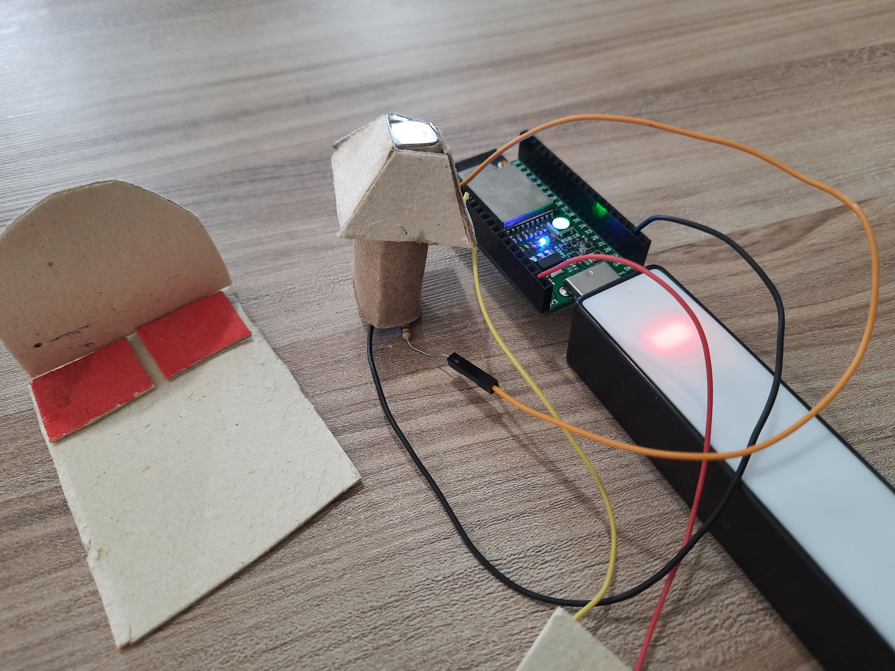
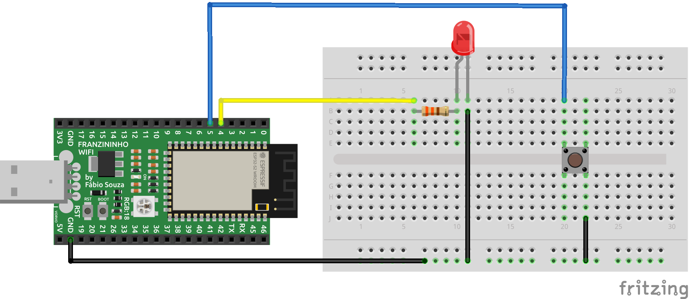

# Botão liga e desliga




## Proposta da atividade

Nesta atividade temos o seguinte exemplo,  como fazer para  um  botão ao ser pressionado acenda um LED e ao pressionar novamente o botão, ele irá desligar o LED.

## Materiais

- 1 Placa Franzininho Wifi;
- 1 Protoboard;
- 1 LED 3mm;
- 1 Resistor 300 Ohm;
- 1 Botão;
- Jumpers

## Circuito




## Código

```python
"""Exemplo 3 - Botão Liga e desliga"""
import time
import board
from digitalio import DigitalInOut, Direction, Pull

# Configurei o botão no pino 5 da Franzininho Wifi
btn = DigitalInOut(board.IO6)
btn.direction = Direction.INPUT
btn.pull = Pull.UP


# o led que configurei foi o pino 4 = IO4
led = DigitalInOut(board.IO4)
led.direction = Direction.OUTPUT


while True:
    if btn.value ==0:
    	#print("BTN is down")
    	led.value=not led.value
        while btn.value==0:
            time.sleep(0.01)

```

## Vídeo

<iframe width="560" height="315" src="https://www.youtube.com/embed/hjIP685puJA" title="YouTube video player" frameborder="0" allow="accelerometer; autoplay; clipboard-write; encrypted-media; gyroscope; picture-in-picture" allowfullscreen></iframe>

## Desafio


!!! note " Dica "
    Utilize a ```#franzininho```  para que nós possamos publicar em nossas redes sociais o seu desafio
