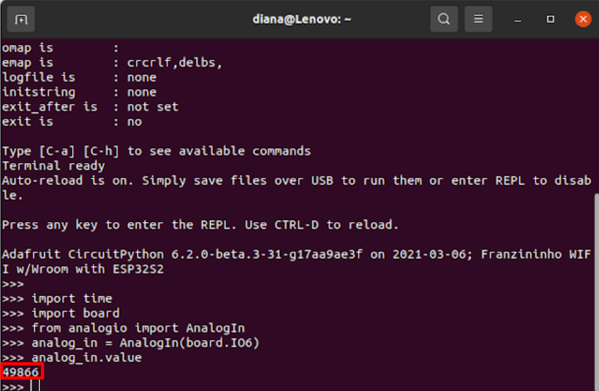
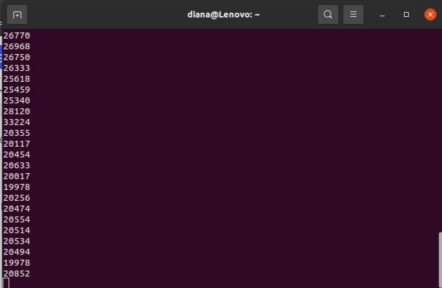

# Sensor de luz com LDR


## Proposta da atividade

Nesta atividade iremos utilizar o LDR como funcionamento de uma fotocélula, onde ao escurecer será aceso o LED, como acontece na luz da rua.

## Materiais

- 1 Placa Franzininho Wifi;
- 1 Protoboard;
- 1 Resistor 330;
- 1 Resistor 10K;
- 1 LDR(10K)
- Jumpers

## Circuito


Antes de sair escrevendo código, vamos testar via  via linha de comando.

## Terminal

Abra o terminal e digite picocom /dev/ ttyACMO e dê o enter se não funcionar digite ctrl C

Digite o comando abaixo, um por vez.

```python
import time
import board
from analogio import AnalogIn
```
Agora configure o pino que você montou no seu circuito, no meu caso usei o pino 6, vamos criar a variável para ele.

```python
ldr = AnalogIn(board.IO6)
```
Agora vamos ver o valor:

```python
ldr.value
```
Veja o resultado, meu caso o valor está dando este valor 49866,  mas lembrando que depende muito da luz que você está recebendo no momento que estiver realizando este exemplo.



Agora vamos criar um while para saber a variação


Você percebe que o valor no meu caso está variando entre 4000 e 5000, quando eu escureço o sensor LDR ele varia para 2000, conforme a imagem abaixo:



Pronto!

Agora vamos testar inserindo um LED e programando ele via o editor MU.


## Código

```python

""""Lição 4 -Sensor de luz com LDR"""

import time
import board
from analogio import AnalogIn
from digitalio import DigitalInOut, Direction

# Configurando o pino do LED, configurei foi o pino 4 = IO4
led = DigitalInOut(board.IO4)
led.direction = Direction.OUTPUT

# Configurando o pino LDR configurei o pino 6 = IO6
analog_in = AnalogIn(board.IO6)


while True:

    media = 0;
    for x in range(50):
    	media += analog_in.value

    media/=50
    print(media)

    if (analog_in.value <15000) :
    	led.value = True
    else:
	led.value = False

    time.sleep(0.2)
```

## Vídeo

<iframe width="560" height="315" src="https://www.youtube.com/embed/ITeomlxueLU" title="YouTube video player" frameborder="0" allow="accelerometer; autoplay; clipboard-write; encrypted-media; gyroscope; picture-in-picture" allowfullscreen></iframe>

## Desafio

Agora o desafio é fazer isso ao contrário. Quando colocar a mão no sensor LDR ao invés do LED acender, o LED irá apagar.


!!! note " Dica "
    Utilize a ```#franzininho```  para que nós possamos publicar em nossas redes sociais o seu desafio
